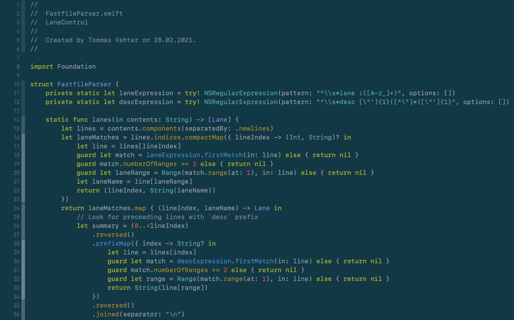
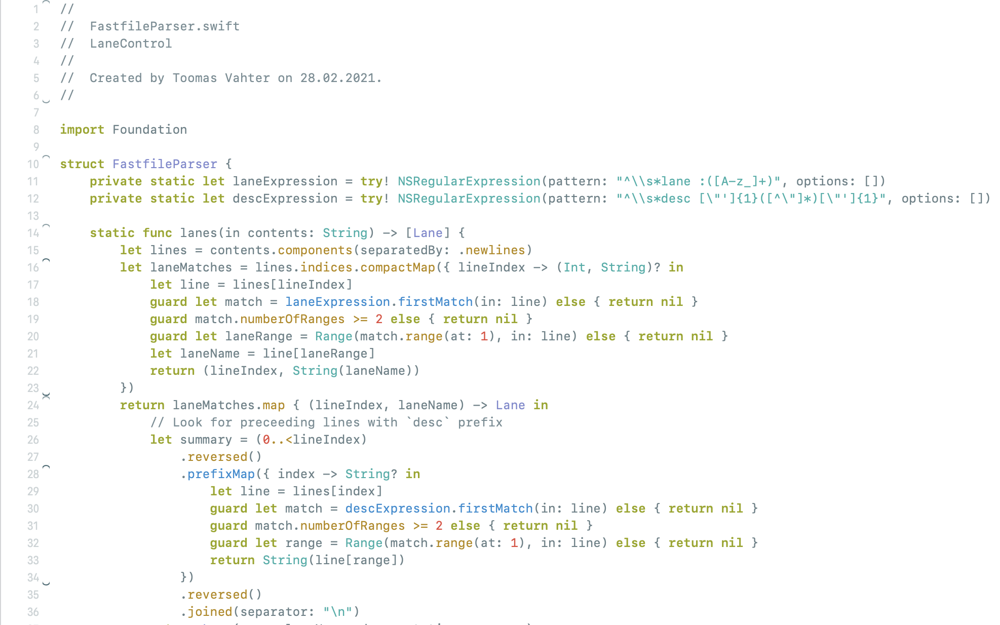

# SolarizedXcodeTheme

## Installation

Copy theme files to `~/Library/Developer/Xcode/UserData/FontAndColorThemes` and relaunch Xcode

Based on the [Solarized palette](https://ethanschoonover.com/solarized/)
